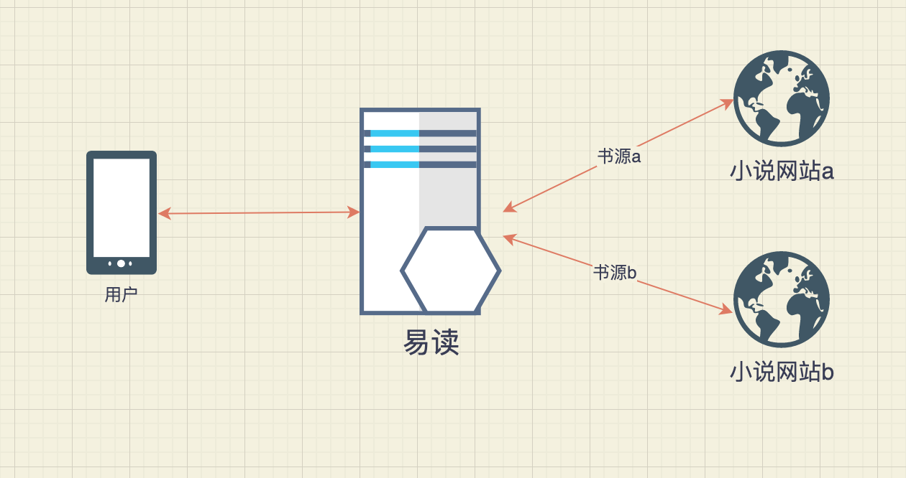

# 易读 yireader

## 介绍

易读是一款简单易用的个人小说阅读器，它以网页(web app)的形式提供服务，这样无论你在任何终端上都可以得到一个比较好的体验。

它的核心目标是下面几点：

* 支持书源。把喜欢站点的书源文件添加进来，就可以将其接入易读中进行搜索和阅读。
* 好的阅读体验。

大家可以登录到 [yireader.com:3001](http://yireader.com:3001) 进行体验。目前已经实现出一个最小化可行性版本，本人已经自用了一段时间，基本够用，后续会继续增强。

## 使用介绍

1. 打开网站后，点击右上角的搜索框，尝试搜索想看的小说
2. 等待出现搜索结果，点击想看的书，进入详情页面，试看或则加入书架以方便到首页观看

下面是 iPhone 6/7/8 上界面示例截图

首页


详情页


章节阅读页


## 部署方法

### 命令行

```bash
docker run --name yireader1 -dp 3001:3001 --env NODE_ENV='production' uhziel/yireader
# 如果提示你权限不够，请确保用 root 用户登录后执行，或者在最前面加上 sudo 也可以
```

### 群晖

0. 确保已经安装好 docker 套件并清楚其基本的使用方法
1. 点击左侧页签"注册表"处搜索"yireader"，点击其中的"uhziel/yireader"并进行下载
2. 等待下载成功后，打开页签"映像"，找到刚下载的"uhzie/yireader"并双击来开始生成运行的容器
   1. 点击左下角的"高级设置"，选择"端口设置"页签，将其"本地端口"下的"自动"替换为3001，或则其他你未使用的端口
   2. 其他均默认设置即可，最后点击"应用"让其生效

### 验证是否生效

打开 http://<你的docker电脑ip>:3001，看下是否部署成功。

后续你可能需要做的是开放外网访问，网上教程比较多，各人环境也一样，这里就不复述了。

## 书源

本阅读器采用的是同安卓app"厚墨"相同的书源格式，具体如何制作书源参见 https://chimisgo.gitbook.io/booksource/publish 。

易读本身不提供数据，通过在易读上配置好书源，从源站点拉取数据、去除广告后，再返回给用户。



目前只是实现了对厚墨书源格式的部分支持，所以还不允许用户"添加自己书源"。

易读自带的几个书源，可以点击导航条上的"书源"页签进行查看。

后续等对其书源格式完整支持后，再开放"添加自己书源"的功能。

## 好的阅读体验

* 速度是第一位考虑的
  * 比如，为了优化打开下一章节的速度，会在阅读当前页时就尝试预先缓存好下一章节，这样基本就能秒开下一章了。
* 虽然是网页，但是尽量提供类似app的体验
  * 比如，正常的网页方式，点开书后是跳跃到详情，再点击到具体章节页开始阅读，没有记忆功能。当阅读几章后，点击浏览器的回退，并不是回到首页，而是回到上一章节。
  * 易读则会类似 app 一样，记忆上一次阅读位置，看过后再次打开书从上一次位置开始阅读。点击浏览器的回退，也是直观的回到首页。

## 后续计划

1. 允许用户添加自定义的书源、管理书源
2. 添加账号系统，方便用户跨设备间同步数据
3. 增强界面表现，有一个更好的阅读体验

## 项目开发设置 Project setup

```
npm install
```

### Compiles and hot-reloads for development
```
npm run serve
```

### Compiles and minifies for production
```
npm run build
```

### Lints and fixes files
```
npm run lint
```

### Customize configuration
See [Configuration Reference](https://cli.vuejs.org/config/).
